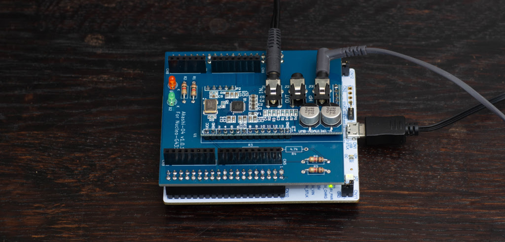
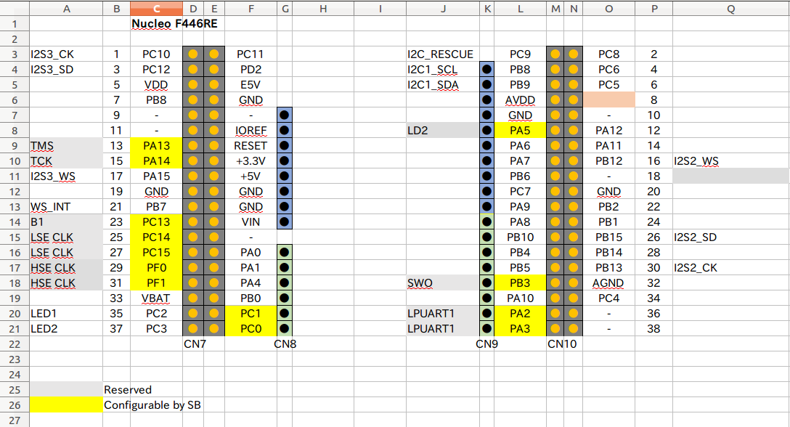

# Akashi-04
Audio board for Nucleo-G431RB

## Functionality
This board is designed to provide the audio functionality for the  STM32 series MCU. 
The connectors can be directly mounted on the Nucleo 64 series board and employs I2S interface of STM32 MCU.
With this board, the following audio interface can be tested :
- STM32F446RE
- STM32G431RB

The design can be retrieved from the [github](https://github.com/suikan4github/Akashi-04) repository.




These functionalities are tested with following codec board as with I2C control line. 
- [UMB-ADAU1361A](http://dsps.shop-pro.jp/?pid=82798273)

## Development
- [KiCad 5.1](http://kicad-pcb.org/blog/2019/03/KiCad-5.1.0-Release/)
- [Nucleo G431RB](https://www.st.com/en/evaluation-tools/nucleo-g431rb.html)
- [Nucleo F446RE](https://www.st.com/en/evaluation-tools/nucleo-f446re.html)


The schematics [can be downloaded](docs/Akashi-04.pdf) as PDF format. 



The configuration of special ports are :
- I2S2 : Slave TX
- I2S3 : Slave RX
- PB7 : EXTI to detect the I2S WS edge. 
- PC9 : Open Drain output. To save the struggled I2C device.


## I2C address
By default, the I2C device address are fixed as ***0x38*** ( 7bit address ). 
If you want to change, you should modify the short bridge as following : 

| JP1    | JP2    | JP3    | JP4    | Address |
---------|--------|--------|--------|---------|
| Closed | Closed | Open   | Open   | 0x38    |
| Open   | Closed | Close  | Open   | 0x39    |
| Closed | Open   | Open   | Closed | 0x3A    |
| Open   | Open   | Closed | Closed | 0x3B    |


J2-J5 as following :
- J2 : Open by cutting the pattern.
- J3 : Close by soldering.
- J4 : Open by cutting the pattern.
- J5 : Close by soldering.

By above modification , the address can be controlled by GPIO PB12 and PA15. The address can be determined as following :

| b6 | b5 | b4 | b3 | b2 | b1    | b0   |
-----|----|----|----|----|-------|---- 
| 0  | 1  | 1  | 1  | 0  | PB12  | PA15 |


## Usage
To clone this project, follow :
```
git clone repository-of-this-project
git submodule update
```


The sample programs are published as [murasaki_samples_audio](https://github.com/suikan4github/murasaki_samples_audio) repositories. 

 To use these repository, follow the sequence :
 1. Clone the murasaki_samples_audio repository
 1. Import to CubeIDE


## License
This PCB design is released under the [Creative Commons Attribution 4.0 International license](https://creativecommons.org/licenses/by/4.0/). 
You are welcome to use this design for commercial purposes. 